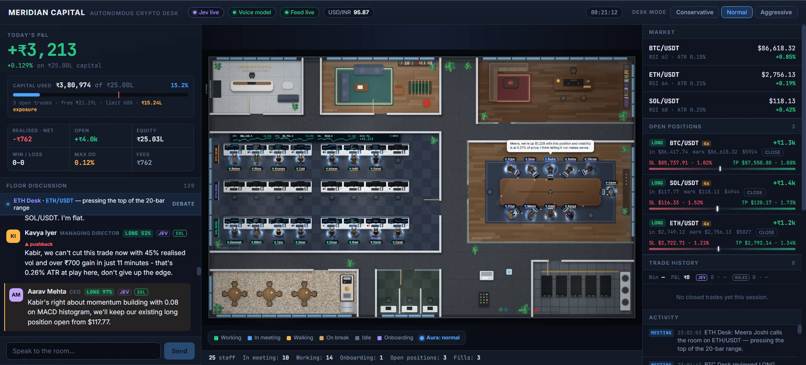

# Trading Office

An autonomous crypto trading firm you can watch. A floor of AI employees — CEO, MD, risk
manager, compliance, team leads, quant and research analysts, execution traders — sit at
desks, walk to meeting rooms, argue about the tape, and come out with a trade. The trade
is then filled against live Binance prices on a paper book denominated in INR.



## How it works

- **Three desks, one coin each** (BTC, ETH, SOL). Each desk runs its own meeting cycle, so
  the floor is always deliberating something without any one team meeting every 15 seconds.
- **A meeting** pulls the live tape, hands every attendee the same market state through a
  role-specific lens, and collects a typed vote. The room's verdict — long, short, stand
  down, hold, close, flip — becomes the order.
- **Open positions are managed, not forgotten.** Later meetings revisit live trades with
  their stop and target on the table and can hold, close, or flip them.
- **Risk is real.** ATR-based stops (1.2× the 1h ATR) and targets (2.0×), per-symbol and
  gross exposure caps, taker fees, and crossing the spread on every fill.
- **The floor hires itself.** When workload justifies it, the firm spawns new employees
  into open roles.

## The brains

Two models, doing two different jobs:

| Layer | Model | Job |
| --- | --- | --- |
| Decision | **Jev** (`typesafe-ai/jev`, via Vercel AI Gateway) | Typed, calibrated choices and scores — direction, conviction, size, leverage. Jev does not write prose. |
| Voice | **llama3.1:8b** (local, via Ollama) | Turns each typed decision into the sentence the agent says in the meeting. |

No key? The floor still runs — every agent falls back to a local calibrated heuristic
brain, and the UI marks decisions as `rules` rather than `jev` so the two are never mixed
in the scoreboard.

## Running it

```bash
npm install
cp .env.example .env   # then fill in AI_GATEWAY_API_KEY if you have one
npm run dev
```

The web UI comes up on Vite's port; the server listens on `SERVER_PORT` (8787 by default)
and pushes floor state over a WebSocket.

For the voice layer:

```bash
ollama pull llama3.1:8b
```

## Layout

```
shared/     Wire contract (types.ts) and office geometry (layout.ts)
server/src/
  market.ts       Binance feed with Coinbase fallback, 5m + 1h candles
  indicators.ts   RSI, EMA, MACD, ATR, realised vol
  jev.ts          Decision layer — per-role lenses, desk mandates, Jev + fallback brain
  paper.ts        INR paper book — fills, fees, stops, targets, leverage, exposure caps
  floor.ts        Orchestrator — teams, meetings, routing, verdicts
  agents.ts       Roster and hiring
  office.ts       Movement and activity
  voice.ts        Ollama wording
  history.ts      Persistent trade history, archived on every restart
web/src/
  Office.tsx      Canvas renderer — floor, furniture, people, fire
  App.tsx         P&L, capital bar, discussion, trade history, staff
```

## Notes

- **Paper trading only.** No exchange keys, no real orders, nothing to lose.
- Trade history is archived to `data/archive/` and cleared on every restart, so a session
  always starts from a clean book.
- `STARTING_CAPITAL_INR` defaults to ₹25,00,000.

## Credits

Built by [Satya](https://github.com/Satya141). Claude (Anthropic) helped write it.
